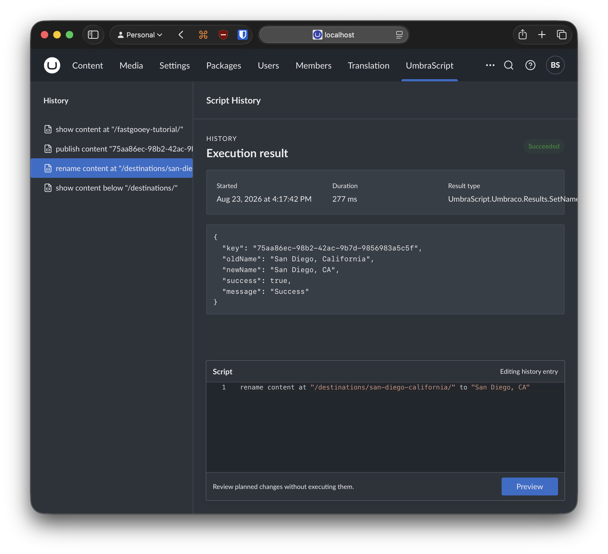

# UmbraScript

UmbraScript is a talk-like scripting language for inspecting and automating content and media in Umbraco CMS.

```text title="UmbraScript"
show content at "/destinations/pensacola-florida/"
```

Use readable statements to find content, update properties, publish a branch, or organize media without writing a one-off application.

[Install UmbraScript](get-started/install.md){ .md-button .md-button--primary }
[Run your first command](get-started/first-command.md){ .md-button }

## What you can do

### Work with content

Inspect, create, publish, unpublish, rename, move, copy, trash, and restore content nodes.

[Browse content commands](reference/content/index.md)

### Work with properties

Read property values across a selection, then set or clear values when you need to make a controlled change.

[Browse property commands](reference/properties/index.md)

### Work with media

Inspect the media tree, create folders, and rename, move, copy, trash, or restore media items.

[Browse media commands](reference/media/index.md)

## Designed for Umbraco



UmbraScript uses familiar Umbraco concepts: content keys, content routes, Document Type aliases, property aliases, the content tree, and the media tree. Keywords are case-insensitive, while names, paths, aliases, and values are written as quoted strings.

UmbraScript is free to use with Umbraco CMS 17 and later.

[Support UmbraScript](https://buy.stripe.com/aFa9AVdqFbydbgz0Ve2Ry03){ .md-button target="\_blank" rel="noopener" }

!!! tip "New to UmbraScript?"
Start with the [five-minute first-command tutorial](get-started/first-command.md). It uses a read-only command and explains the result before introducing commands that change your site.
